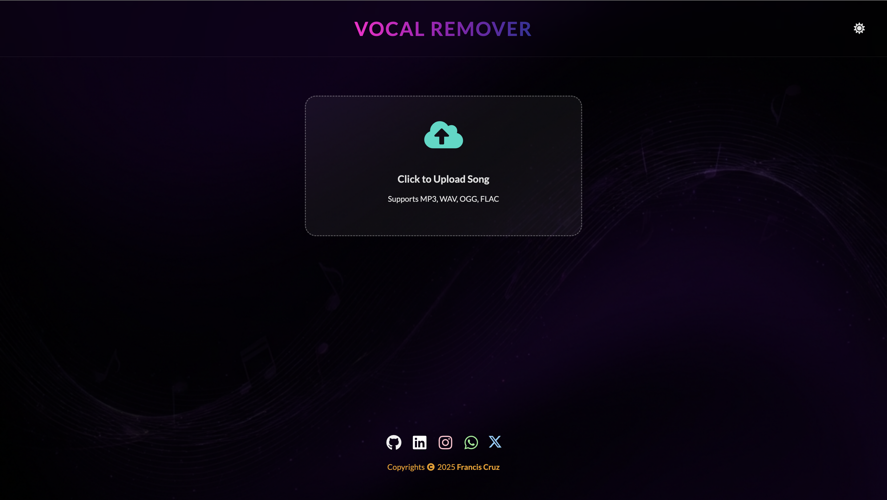
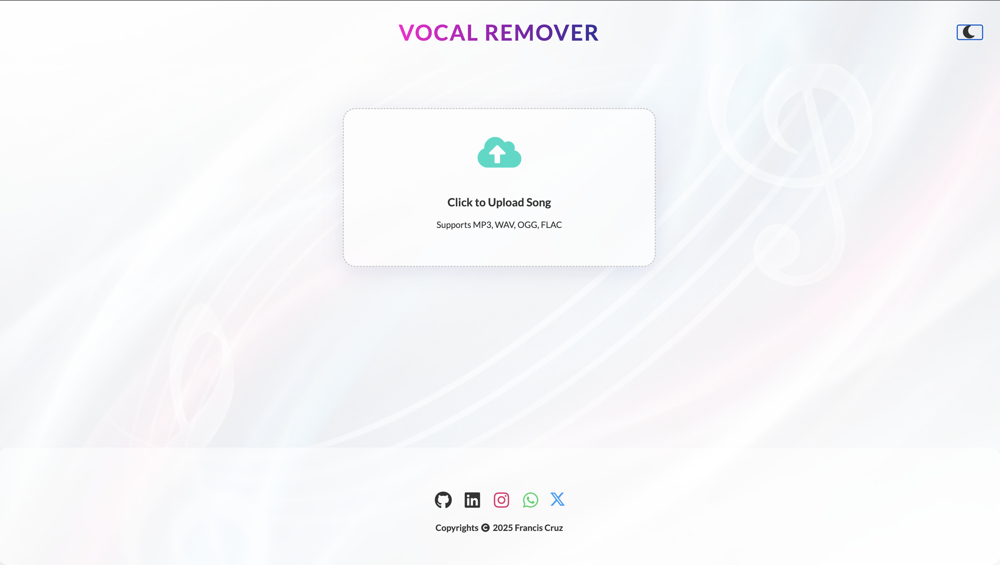

# 🎵 AI Vocal Remover App

A premium, client-side Progressive Web App (PWA) that uses Artificial Intelligence to separate vocals, instruments, and chorus from any audio file. Built with React, TensorFlow.js, and modern web technologies.


## 📸 Screenshots

| Dark Mode 🌑 | Light Mode ☀️ |
|:---:|:---:|
|  |  |

## ✨ Features

-   **🤖 AI-Powered Separation**: Uses **TensorFlow.js** to perform real-time spectral masking and signal separation entirely in the browser. No server uploads required!
-   **🎼 3-Stem Isolation**: Generates individual tracks for:
    -   **Vocals** (Center Channel extraction & refinement)
    -   **Instruments** (Karaoke/Backing refinement)
    -   **Chorus** (Spatial/Side channel enhancement)
-   **💾 MP3 Downloads**: Download each separated stem as a high-quality `.mp3` file (128kbps) using `lamejs`.
-   **🌊 Interactive Player**:
    -   Waveform visualization powered by `wavesurfer.js`.
    -   Individual Volume Sliders for mixing.
    -   Play/Pause controls.
-   **🎨 Premium UI/UX**:
    -   **Dark/Light Themes**: Beautiful, glassmorphism-inspired interface with custom 4K abstract musical backgrounds.
    -   **Animations**: Smooth entry animations using AOS.
    -   **Responsive**: Fully optimized for Desktop, Tablet, and Mobile.
-   **📱 PWA Support**: Installable on iOS and Android devices for an app-like experience. Offline capable.

## 🛠️ Tech Stack

-   **Frontend**: React 18, Vite
-   **AI Engine**: @tensorflow/tfjs
-   **Audio Processing**: Web Audio API, lamejs (MP3 Encoding)
-   **Visualization**: wavesurfer.js
-   **Styling**: CSS3, Semantic UI React
-   **Animations**: AOS (Animate On Scroll)

## 🚀 Getting Started

### Prerequisites

-   Node.js (v16+)
-   npm or yarn

### Installation

1.  Clone the repository:
    ```bash
    git clone https://github.com/your-username/vocal-remover-app.git
    cd vocal-remover-app
    ```

2.  Install dependencies:
    ```bash
    npm install
    ```

3.  Run the development server:
    ```bash
    npm run dev
    ```

4.  Open `http://localhost:3000` (or the port shown in terminal) to view it in the browser.

### Building for Production

To build the app for deployment (renders to `/dist` folder):

```bash
npm run build
```

## 🖼️ Assets

-   **Icons**: Custom Treble Clef vector branding.
-   **Backgrounds**: Generated abstract musical art for specific themes.

## 📄 License

This project is open source and available under the [MIT License](LICENSE).
